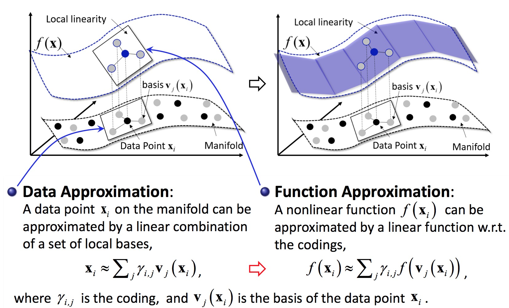
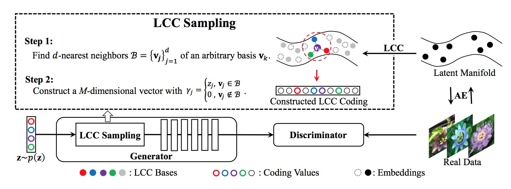
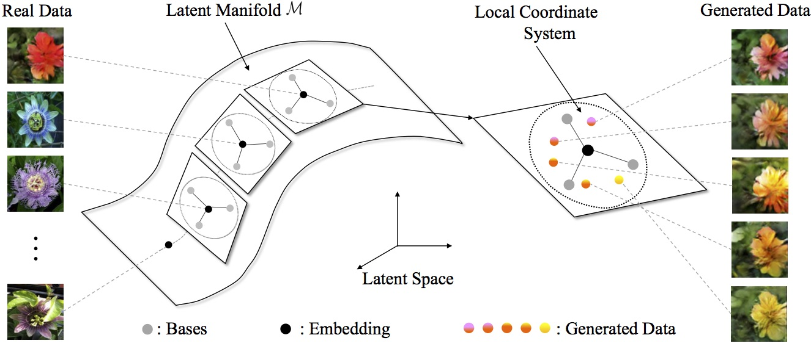
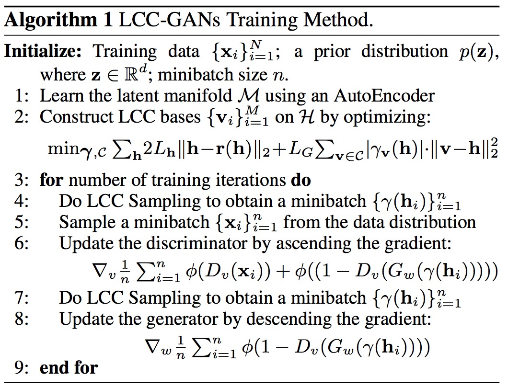

# LCCGAN

Pytorch implementation for “Adversarial Learning with Local Coordinate Coding”.

<!-- 
## Demonstration of Local Coordinate Coding (LCC)

-->

## Architecture of LCCGAN
<div align=center>

</div>


- AutoEncoder (AE) learns embeddings on the latent manifold.
- Local Coordinate Coding (LCC) learns local coordinate systems.
- The LCC sampling method is conducted on the latent manifold.

## Gometric Views of LCC Sampling
<div align=center>

</div>

- With the help of LCC, we obtain local coordinate systems for sampling on the latent manifold.
- Using the local coordinate systems, LCC-GANs always sample some meaningful points to generate new images with different attributes.

<!-- ## Objective Function
 -->

## Training Algorithm


## Dependencies
python 2.7

Pytorch

## Dataset
In our paper, to sample different images, we train our model on four datasets, respectively.

- Download [MNIST](https://pytorch.org/docs/stable/torchvision/datasets.html#mnist)  dataset.

- Download [Oxford-102 Flowers](http://www.robots.ox.ac.uk/~vgg/data/flowers/102/)  dataset.

- Download [Large-scale CelebFaces Attributes (CelebA)](http://mmlab.ie.cuhk.edu.hk/projects/CelebA.html)  dataset.

- Download [ Large-scale Scene Understanding (LSUN) ](http://lsun.cs.princeton.edu/2016/)  dataset.

## Training
- Train LCCGAN on Oxford-102 Flowers dataset.
```
python train.py --dataset flowers --dataroot your_images_folder --batchSize 64 --imageSize 64 --cuda
```
- If you want to train the model on Large-scale CelebFaces Attributes (CelebA), Large-scale Scene Understanding (LSUN) or your own dataset. Just replace the hyperparameter like these:
```
python train.py --dataset name_o_dataset --dataroot path_of_dataset
```

## Citation
```
@InProceedings{pmlr-v80-cao18a,
  title = 	 {Adversarial Learning with Local Coordinate Coding},
  author = 	 {Cao, Jiezhang and Guo, Yong and Wu, Qingyao and Shen, Chunhua and Huang, Junzhou and Tan, Mingkui},
  booktitle = 	 {Proceedings of the 35th International Conference on Machine Learning},
  pages = 	 {707--715},
  year = 	 {2018},
  editor = 	 {Dy, Jennifer and Krause, Andreas},
  volume = 	 {80},
  series = 	 {Proceedings of Machine Learning Research},
  address = 	 {Stockholmsmässan, Stockholm Sweden},
  month = 	 {10--15 Jul},
  publisher = 	 {PMLR}
}
```